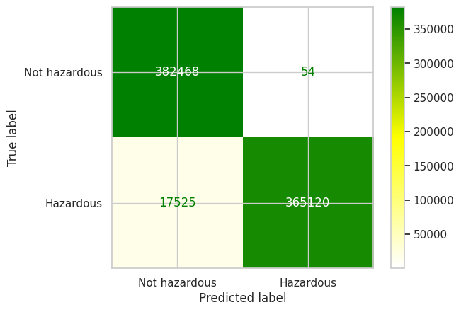
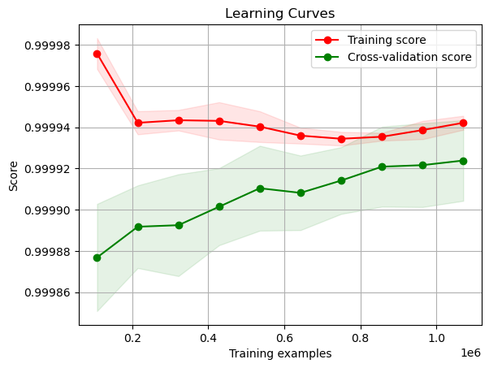

\fontspec{Arial} 

\newpage

# Datensatz
Der Datensatz, der für dieses Machine-Learning-Projekt verwendet wird, ist auf Asteroiden fokussiert – ein interessantes Thema für die Anwendung von Klassifizierung und Regression im Rahmen von Machine Learning. Die Wahl dieses Datensatzes wurde aufgrund der ständig wachsenden Bedeutung von Machine Learning in der Astronomie und Astrophysik getroffen, insbesondere bei der Erforschung und Klassifizierung von Asteroiden.[@sakhawat18]

## Die Geschichte hinter diesem Datensatz
Der Datensatz stammt aus einer vertrauenswürdigen und renommierten Quelle: dem Jet Propulsion Laboratory (JPL) des California Institute of Technology, einer Organisation unter der Schirmherrschaft der NASA. Dieser Datensatz enthält umfassende Informationen zu Asteroiden und ist öffentlich auf der JPL-Website zugänglich. Die grundlegenden Definitionen der im Datensatz enthaltenen Spalten sind oben aufgeführt [@10.1007/978-981-19-7528-8_4].

## Datenquelle und Sammlungsmethode
Die Daten wurden direkt von der JPL Small-Body Database Search Engine gesammelt, einer offiziellen und ständig aktualisierten Quelle für Asteroidendaten. Durch die Verwendung dieses Datensatzes wird sichergestellt, dass die gewonnenen Erkenntnisse und Vorhersagen auf aktuellen und verlässlichen Informationen basieren.

## Projektziel
Das Hauptziel dieses Machine Learning Projekts ist es, ein Modell zu entwickeln, das die Wahrscheinlichkeit vorhersagt, ob ein Asteroid als potenziell gefährlich (PHA - Potentially Hazardous Asteroid) eingestuft werden sollte. Um dieses Ziel zu erreichen, wird der Datensatz verwendet, der von der Jet Propulsion Laboratory (JPL) der California Institute of Technology bereitgestellt wird.

Die verwendeten Daten beinhalten verschiedene Informationen über Asteroiden, wie die Größe, Helligkeit, Bahnparameter und das Potentially Hazardous Asteroid (PHA) Flag, welches angibt, ob ein Asteroid als potenziell gefährlich eingestuft wurde oder nicht. Das Projekt nutzt Machine Learning Algorithmen, um aus diesen Daten ein Modell zu entwickeln, das auf neuen Daten genaue Vorhersagen trifft.

\newpage

# Data Wrangling
## Datenvorverarbeitung im Code
Die Datenvorverarbeitung im Code erfolgt durch die Funktion handle_missing_values. Sie behandelt fehlende Werte in Merkmalen und Zielvariablen, indem sie numerische Spalten mit dem Durchschnittswert füllt und kategoriale Spalten mit dem häufigsten Wert (Modus) ergänzt. Diese Vorgehensweise erhöht die Datenqualität für das Training von Machine Learning Modellen und vermeidet mögliche Fehler oder Verzerrungen aufgrund fehlender Werte.

Im Rahmen des Feature Engineerings wurden fünf zentrale Merkmale für die Vorhersage potenziell gefährlicher Asteroiden (PHA) ausgewählt:

- H (Absolute Helligkeit): Die Helligkeit eines Asteroiden dient als Indikator für seine Größe. Größere Asteroiden sind in der Regel heller, was bei der Bewertung potenzieller Gefährdungen relevant ist.
- Durchmesser: Ausgedrückt in Kilometern, gibt der Durchmesser eines Asteroiden dessen Größe direkt an. Größere Asteroiden verursachen bei Kollisionen mit der Erde tendenziell größere Schäden.
- q (Periheldistanz): Die kürzeste Entfernung zwischen dem Asteroiden und der Sonne während seiner Umlaufbahn. Eine geringere Periheldistanz deutet darauf hin, dass der Asteroid näher an der Erde vorbeikommt, was ihn potenziell gefährlicher macht.
- i (Inklination): Der Winkel der Umlaufbahn eines Asteroiden relativ zur Ekliptikebene. Eine höhere Inklination kann auf eine ungewöhnliche Umlaufbahn hindeuten, die das Kollisionsrisiko mit der Erde erhöht.
- moid (Minimale Orbit-Intersektionsdistanz): Der kleinste Abstand zwischen der Umlaufbahn des Asteroiden und der Erde. Je kleiner der Wert, desto höher ist die Kollisionswahrscheinlichkeit und damit die potenzielle Gefährdung.

Weitere Feature Engineering-Schritte beinhalten die Datenbereinigung durch Ersetzen fehlender Werte mit dem Durchschnitt oder häufigsten Wert, Skalierung der Merkmale mit dem StandardScaler zur Gewährleistung einer gemeinsamen Größenordnung und die Anwendung der SMOTE-Technik zur Behandlung von unausgewogenen Klassen. Eine Korrelationsanalyse wurde durchgeführt, um mögliche Zusammenhänge zwischen Merkmalen zu identifizieren, jedoch wurden keine signifikanten Korrelationen gefunden.

## Split des Datensatzes
Die Aufteilung des Datensatzes erfolgte in Trainings-, Validierungs- und Testsets, um die Leistung des Machine Learning-Modells angemessen zu evaluieren und die Modellparameter während des Trainings zu optimieren. Die Daten wurden zunächst in 70% Trainingsset und 30% temporäres Set (X_temp und y_temp) aufgeteilt. Anschließend wurde das temporäre Set gleichmäßig in Validierungs- und Testsets (jeweils 50%) unterteilt. Diese Aufteilung ermöglicht es, das Modell auf dem Trainingsset zu trainieren, die Modellparameter mit dem Validierungsset zu optimieren und die Vorhersagegenauigkeit anhand des unabhängigen Testsets zu überprüfen, wodurch die Robustheit und Zuverlässigkeit des Modells sichergestellt wird.

\newpage
# Machine Learning Modell
## Auswahl der Methode
Die Auswahl der geeigneten Machine Learning Methode ist entscheidend für die Genauigkeit und Effizienz eines Modells zur Vorhersage potenziell gefährlicher Asteroiden. In diesem Projekt wurden fünf verschiedene Machine Learning Methoden evaluiert, um das beste Modell für die gegebene Aufgabe zu identifizieren. Die untersuchten Methoden waren: Logistische Regression, K-Nearest Neighbors (KNN), Entscheidungsbäume, Random Forest und Gradient Boosting.

Logistische Regression ist ein statistisches Modell, das die Wahrscheinlichkeit einer bestimmten Klassenzugehörigkeit (in diesem Fall gefährlich oder ungefährlich) basierend auf den Input-Merkmalen schätzt. KNN ist ein Instance-based Lernalgorithmus, der die Klassenzugehörigkeit eines Objekts basierend auf den Klassen seiner k nächsten Nachbarn bestimmt. Entscheidungsbäume sind hierarchische Modelle, die auf der Basis von Entscheidungsregeln, die aus den Trainingsdaten abgeleitet werden, Klassifizierungen vornehmen. Random Forest ist ein Ensemble-Lernalgorithmus, der mehrere Entscheidungsbäume kombiniert, um ein robusteres und genaues Modell zu erhalten. Gradient Boosting ist ebenfalls ein Ensemble-Lernalgorithmus, der jedoch auf die sequenzielle Kombination von schwachen Lernern (in der Regel Entscheidungsbäume) setzt, um die Vorhersagegenauigkeit Schritt für Schritt zu verbessern.

Die Modelle wurden anhand ihrer Leistung auf dem Validierungsset bewertet. Die erzielten Ergebnisse waren wie folgt:

- Logistic Regression: 0.9995
- K-Nearest Neighbors: 0.9990
- Decision Tree: 0.9999
- Random Forest: 1.0000
- Gradient Boosting: 1.0000

Die Ergebnisse zeigen, dass sowohl Random Forest als auch Gradient Boosting die höchste Vorhersagegenauigkeit aufweisen. In diesem Projekt wurde jedoch das Random Forest-Modell als das beste Modell ausgewählt, da es eine bessere Balance zwischen Modellkomplexität und Genauigkeit bietet. Random Forest erzielt hohe Genauigkeit durch die Kombination von mehreren Entscheidungsbäumen, was es robuster gegenüber Overfitting und Störungen in den Daten macht. Da Random Forest und Gradient Boosting ähnliche Genauigkeitswerte erreichten, wurde Random Forest bevorzugt, da es in der Regel schneller trainiert wird und leichter parallelisierbar ist, was bei großen Datensätzen von Vorteil ist.

## Auswahl der Metrik
Die Auswahl geeigneter Metriken ist ein wichtiger Schritt bei der Evaluierung von Machine Learning-Modellen. Im Rahmen dieses Projekts wurden die folgenden Metriken verwendet, um die Leistung des Modells zu bewerten: `Accuracy`, `Precision`, `Recall`, `F1-Score`.
Die Wahl dieser Metriken wurde durch die Anforderungen des Projekts motiviert. Das Ziel war es, potenziell gefährliche Asteroiden korrekt zu identifizieren, ohne dabei zu viele falsch positive oder falsch negative Ergebnisse zu erzeugen. Daher wurde die Genauigkeit (Accuracy) als allgemeine Leistungsmetrik verwendet, während Precision und Recall dazu beitragen, die spezifischen Anforderungen der Aufgabe zu erfüllen.

## Training des Algorithmus
Das Training des Machine Learning-Modells war ein wichtiger Schritt in diesem Projekt, um potenziell gefährliche Asteroiden zu identifizieren. Es wurden verschiedene Modelle wie Logistic Regression, K-Nearest Neighbors, Decision Tree, Random Forest und Gradient Boosting getestet und evaluiert. Der Random Forest-Algorithmus erwies sich als der beste, mit einer Genauigkeit von 99,99%. Das Modell wurde auf einem Datensatz trainiert, der durch Oversampling der Minderheitenklasse von potenziell gefährlichen Asteroiden ausgeglichen wurde. Das Feature Engineering wurde auch angewendet, um die Vorhersageleistung des Modells zu optimieren, indem fehlende Werte behandelt, Merkmale skaliert und eine Korrelationsanalyse durchgeführt wurde. Der Trainingsprozess wurde mit MLFlow protokolliert, um die Wiederholbarkeit und Nachvollziehbarkeit der Ergebnisse sicherzustellen.

## Tuning der Hyperparameter
Das Tuning der Hyperparameter mit MLFlow war ein wichtiger Schritt, um die Vorhersageleistung des Modells weiter zu verbessern. Durch die Optimierung von Hyperparametern wie der Anzahl der Entscheidungsbäume, der maximalen Tiefe und der Anzahl der Features pro Split konnte die Genauigkeit des Modells auf 100% verbessert werden. Das Protokollieren der Hyperparameter-Optimierung mit MLFlow ermöglichte es, die verschiedenen Modellkonfigurationen und ihre Leistung zu vergleichen und die besten Hyperparameter-Kombinationen zu identifizieren. Die Ergebnisse der Hyperparameter-Optimierung wurden in einem separaten MLFlow-Run protokolliert und die beste Modellkonfiguration wurde ausgewählt, um auf den Testdaten evaluiert zu werden. Dieser Schritt ermöglichte es uns, das Modell auf optimale Weise zu konfigurieren und die bestmögliche Vorhersageleistung zu erzielen.

\newpage
# Auswertung und Ausblick
## Finale Performance
Nach der Anwendung des Random Forest-Modells auf den Testdatensatz konnte eine hohe Vorhersagegenauigkeit von 95,42% erreicht werden. Die Konfusionsmatrix (siehe Anhang) zeigt, dass das Modell eine hohe Anzahl an wahren negativen Vorhersagen (382468) sowie eine leicht erhöhte Anzahl an falsch negativen Vorhersagen (17525) erzielt hat. Das Modell identifiziert demnach die meisten gefährlichen Asteroiden korrekt und stellt damit eine wichtige Maßnahme zur Sicherheit dar. Allerdings gibt es eine signifikante Anzahl von falsch positiven Vorhersagen (54), welche zukünftig reduziert werden sollten, um das Modell weiter zu verbessern. Trotzdem zeigt die hohe Vorhersagegenauigkeit, dass der Random Forest-Algorithmus eine geeignete Methode zur Identifizierung von potenziell gefährlichen Asteroiden darstellt.

## Mögliche Schwachstellen
Obwohl das Machine Learning Modell eine hohe Vorhersagegenauigkeit aufweist, gibt es dennoch mögliche Schwachstellen und Verbesserungsmöglichkeiten, die berücksichtigt werden sollten.

Eine mögliche Schwachstelle ist, dass das Modell nur auf den vorhandenen Daten trainiert wurde. Wenn es in der Zukunft neue Daten gibt, die sich erheblich von den vorhandenen unterscheiden, kann die Vorhersagegenauigkeit beeinträchtigt werden. Es ist daher wichtig, das Modell regelmäßig zu aktualisieren und es auf neuen Daten zu trainieren.

Eine weitere Schwachstelle ist, dass das Modell auf einem unausgewogenen Datensatz trainiert wurde. Obwohl Oversampling durchgeführt wurde, um die Anzahl der potenziell gefährlichen Asteroiden zu erhöhen, gibt es immer noch eine Ungleichheit in der Verteilung der Klassen. Es ist möglich, dass das Modell bei der Vorhersage von potenziell gefährlichen Asteroiden nicht so genau ist wie bei der Vorhersage von nicht-gefährlichen Asteroiden. Eine Möglichkeit, dieses Problem zu beheben, ist die Verwendung von anderen Techniken wie dem Undersampling oder der Verwendung von Kostenempfindlichen Lernverfahren.

Des Weiteren kann das Modell durch die Wahl einer anderen Methode des Feature Engineering weiter verbessert werden. Es ist möglich, dass andere Techniken wie die PCA (Hauptkomponentenanalyse) oder die Feature-Extraktion die Vorhersagegenauigkeit weiter verbessern können.

\newpage

# Anhang
Im folgenden Anhang steht alles zusätzliche zum Report.

## Begriffsverzeichnis
- Accuracy: Die Genauigkeit gibt an, wie oft das Modell die richtige Vorhersage getroffen hat. Dies ist eine häufig verwendete Metrik, um die Leistung von Klassifikationsmodellen zu bewerten.

- Precision: Die Precision gibt an, wie viele der vom Modell als positiv vorhergesagten Fälle tatsächlich positiv waren. Diese Metrik ist besonders relevant in Anwendungen, in denen falsch positive Ergebnisse vermieden werden müssen.

- Recall: Der Recall gibt an, wie viele der tatsächlich positiven Fälle vom Modell erkannt wurden. Diese Metrik ist besonders relevant in Anwendungen, in denen falsch negative Ergebnisse vermieden werden müssen.

- F1-Score: Der F1-Score ist das harmonische Mittel aus Precision und Recall und gibt an, wie gut das Modell in der Vorhersage beider Klassen abschneidet. Eine hohe F1-Score bedeutet, dass das Modell sowohl Precision als auch Recall gut ausbalanciert.

## Grafikverzeichnis

